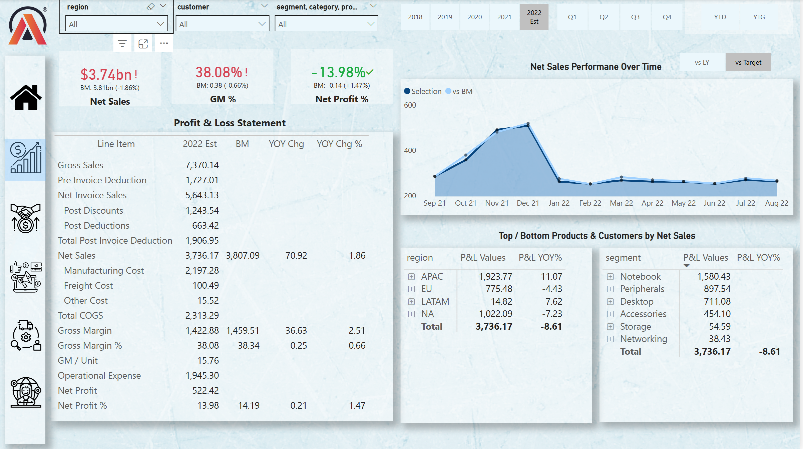
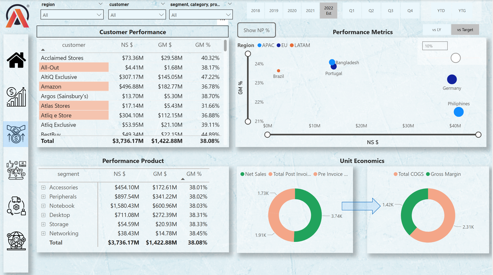
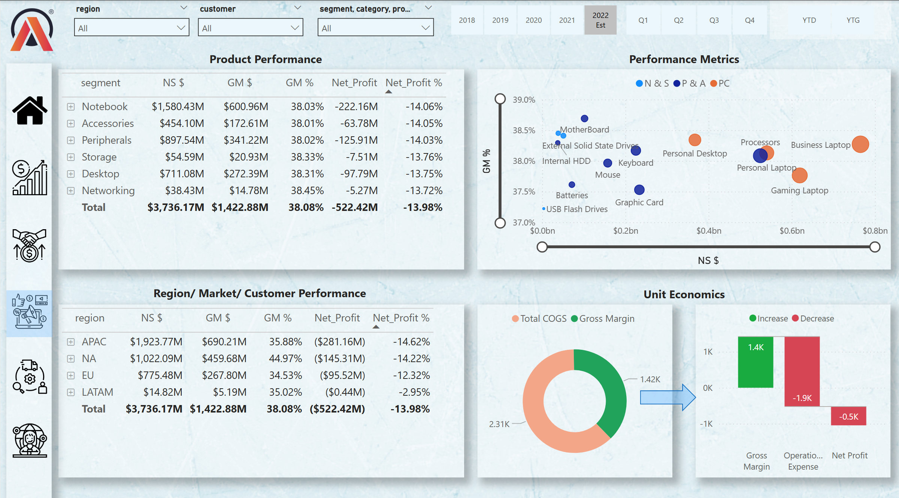
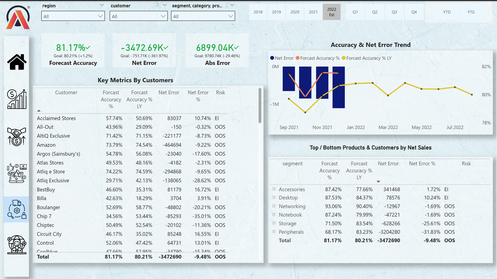
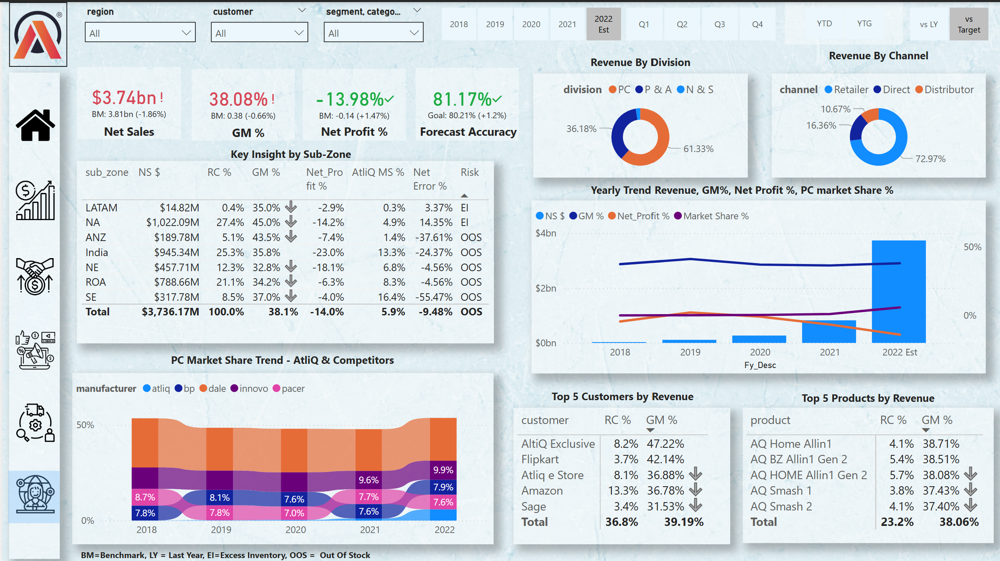

# 📊 Business Insights 360 – Power BI Dashboard  

## 📌 Project Overview  
The **Business Insights 360 Dashboard** is an end-to-end data analytics project built in **Power BI** to provide actionable insights across Finance, Sales, Market, Supply Chain, and Executive levels.  

It consolidates raw transactional and operational data into interactive dashboards, helping stakeholders analyze **Net Sales, Profitability, Customer Segments, Market Share, Forecast Accuracy, and Supply Chain Metrics**.  

---

## 🎯 Business Objectives  
- Identify revenue trends and profit margins by product, region, and customer.  
- Track **Net Sales, GM%, and Net Profit %** across different business functions.  
- Improve **Forecast Accuracy** and reduce **Net Errors**.  
- Analyze customer and product performance for **data-driven decision making**.  
- Provide executives with a **single source of truth** for monitoring business performance.  

---

## 📂 Dashboard Views  

### 1️⃣ Finance View  
- Profit & Loss Statement (Net Sales, COGS, Gross Margin, Net Profit).  
- Year-over-Year (YOY) performance comparison.  
- Regional and product-based profitability breakdown.  

  

---

### 2️⃣ Sales View  
- Customer-wise Net Sales and GM%.  
- Performance metrics by region & country.  
- Product category contribution to overall sales.  

  

---

### 3️⃣ Market View  
- Product performance across different regions.  
- Net Profit % contribution by market.  
- Unit economics with Gross Margin vs COGS.  

  

---

### 4️⃣ Supply Chain View  
- Forecast Accuracy %, Net Error %, and Absolute Error.  
- Customer-level demand & supply gap analysis.  
- Product-wise supply performance metrics.  

  

---

### 5️⃣ Executive View  
- High-level KPIs: **Net Sales, GM%, Net Profit %, Forecast Accuracy**.  
- Revenue analysis by **Division & Channel**.  
- PC Market Share vs Competitors trend.  
- Top 5 Customers and Products by revenue.  

  

---

## 🛠 Tools & Technologies  
- **Power BI** – Data visualization & dashboard design  
- **SQL** – Data extraction & transformation  
- **Excel** – Data cleaning & validation  
- **DAX** – Custom measures & KPIs  

---

## 🚀 Key Insights  
- Net Sales: **$3.74bn** with a GM% of **38.08%**.  
- Net Profit %: **-13.98%**, highlighting cost management challenges.  
- Forecast Accuracy: **81.17%**, with opportunities to reduce errors.  
- Laptops and Notebooks are the **highest revenue-generating products**.  
- NA and APAC are the **strongest performing regions** in revenue contribution. -360
